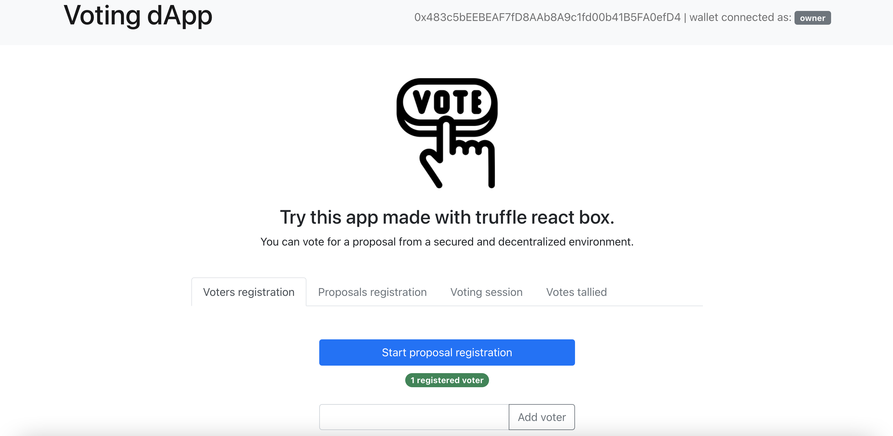

# Voting dApp

## Voting process

- The smart contract owner is a voter
- Only 1 winner is designated
- 50 proposals max are allowed
- The owner can reset the vote after the tally

## Install dependencies

```
npm install

// Install truffle
npm install truffle

// Install ganache
npm install ganache-cli

// Install eth-gas-reporter
npm install eth-gas-reporter
```

## Run unit tests

```
// Run ganache
ganache-cli

// Run migrations
truffle migrate

// Run tests
truffle test
```

> 27 passing tests

1 file: `VotingTest.js`

## Start app

```
// Run ganache
ganache-cli

// Run migrations
truffle migrate

// Go to client folder
cd client

// Start react app
npm start
```

## App deployed on Heroku

https://voting-react-dapp.herokuapp.com/



